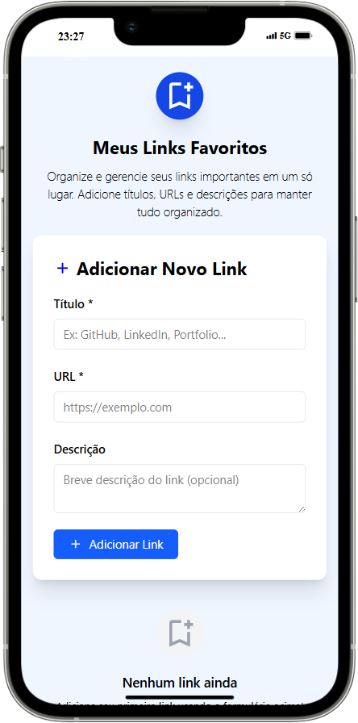
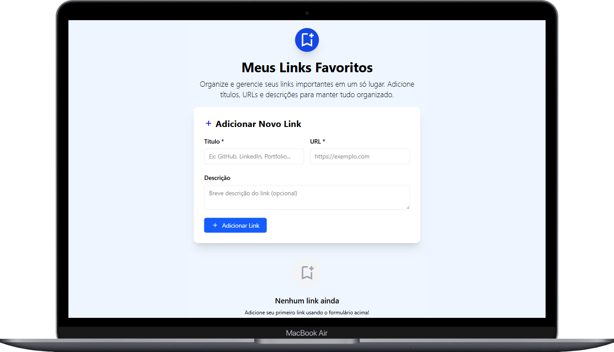

# 🔗 Meus Links Favoritos

Este é um projeto desenvolvido com **React + TypeScript + Tailwind CSS**, que permite cadastrar, visualizar e gerenciar seus links favoritos em um só lugar.

## 🚀 Funcionalidades

- ✅ Adição de links com título, URL e descrição
- ✅ Validação de URL
- ✅ Abertura do link em nova aba
- ✅ Visualização opcional da descrição
- ✅ Remoção de links
- ✅ Responsivo para celular, tablet e desktop
- ✅ Feedback visual com `SweetAlert2`

## 🖼️ Interface
<div align="center">
  
  
</div>

## 🛠️ Tecnologias

- [React](https://reactjs.org/)
- [TypeScript](https://www.typescriptlang.org/)
- [Tailwind CSS](https://tailwindcss.com/)
- [SweetAlert2](https://sweetalert2.github.io/)

## 📦 Como rodar o projeto

```bash
# Clone o repositório
git clone git@github.com:thalissongoncalves/Meus-links-favoritos-VITE-REACT-TS-TWCSS.git

# Instale as dependências
npm install

# Rode o projeto
npm run dev
